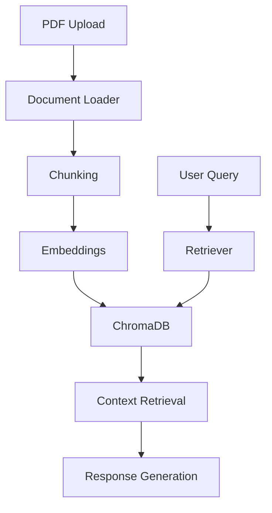

# Enterprise RAG Knowledge Assistant

An enterprise-grade Retrieval-Augmented Generation (RAG) platform built using FastAPI, LangChain, ChromaDB, and Sentence Transformers.

## Features

- PDF Upload & Processing
- Semantic Search
- Vector Embeddings
- ChromaDB Vector Store
- FastAPI Backend
- Streamlit Frontend
- Source Citation Support
- Multi-Document Retrieval

## Tech Stack

- Python
- FastAPI
- LangChain
- ChromaDB
- Sentence Transformers
- Streamlit
- Docker
- AWS

## Architecture

User Query
↓
Retriever
↓
ChromaDB
↓
Relevant Chunks
↓
Response Generator
↓
Answer + Sources

## Project Status

Add GitHub Actions workflow\

## Architecture

🚀 Currently under active development.
